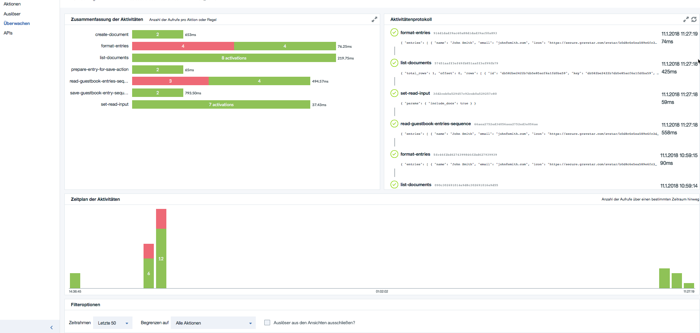

# A serverless guestbook web application and API built with Cloud Functions

[Serverless Web Application and API with IBM Functions](https://console.bluemix.net/docs/tutorials/serverless-api-webapp.html#serverless-web-application-and-api)

The application is a simple guestbook website where users can post messages. It demonstrates how to build a serverless web application where static content is hosted in a storage bucket (here it uses GitHub Pages) and the backend is implemented with Cloud Functions. API Gateway is used to expose the Cloud Functions for the web user interface.

Refer to [this tutorial](https://console.bluemix.net/docs/tutorials/serverless-api-webapp.html) for instructions.

## License

See [License.txt](License.txt) for license information.

---
_German Version_

# Inhaltsverzeichnis <a name="part99"></a>

* [Beispiel: Realisierung einer einfachen Gästebuchanwendung mit IBM Functions](#part0)
* [Use Cases](#part1)
* [Beispielanwendung Guestbook](#part2)
* [Kommunikationsablauf](#part3)
* [Voraussetzungen](#part4)
* [Schritte](#part5)
* [1. Erstellen einer Cloudant Datenbank**](#part6)
* [2. Erstellen von **Actions** und **Sequences**](#part7)
* [  2.1 Erstellen einer Sequenz von Aktionen um Datenbankeinträge zu speichern](#part8)
* [  2.2 Erstellen einer Sequenz von Aktionen um Datenbankeinträge zu erhalten](#part9)
* [3. Erstellen einer REST-API für die Sequenzen](#part10)
* [4. Verwenden der Serverless API in einer WebAnwendung](#part11)
* [5. Überwachen der IBM Functions Aktivitäten](#part12)

---

# Realisierung einer einfachen Gaestebuchanwendung mit IBM Functions <a name="part0"></a>

[zurück zum Inhaltverzeichnis](#part99)

Das Ziel dieser Beispielanwendung ist es Ihnen die wichtigsten Punkte von IBM Functions (**Serverless**) zu vermitteln.

* Implementierung der **Business Logik** erfolgt mit Sequences und Actions
* Die Integration zu der Datenbank **Cloudant** wird mittels bestehender **Event-Provider** realisiert
* Um die Zugriffe einfach für die WebAnwendung bereitzustellen, wird eine **REST API** innerhalb von **IBM Cloud Functions** erstellt und über ein **API Gateway** zur Verfuegung gestellt
(die Anwendung kann in GitHub als einfache WebPage oder z.B. auf einem Node.JS Server in IBM Cloud laufen)

---
## Use Cases: <a name="part1"></a>

[zurück zum Inhaltverzeichnis](#part99)


---
## Beispielanwendung Guestbook <a name="part2"></a>

[zurück zum Inhaltverzeichnis](#part99)


---
## Kommunikationsablauf <a name="part3"></a>

[zurück zum Inhaltverzeichnis](#part99)

1. Der Anwender ruft einen Browser auf seinem Device auf
2. Über **GitHub**, **Lokal** oder **Online** greift der Anwender auf die Gästebuchanwendung zu
3. In der Gästebuchanwendung wird auf das Backend in **IBM Cloud Functions** mittels einer **REST API** zugegriffen
4. Der **REST API** Request wird zu **IBM Cloud Functions** weitergeleitet
5. Innerhalb von **IBM Cloud Functions** werden die API-Aufrufe als mittels **Sequences**, **Actions** und **Events** die Business Logik und die Zugriffe auf die Daten innerhalb einer **Cloudant Datenbank** umgesetzt.


---
# Voraussetzungen <a name="part4"></a>
[zurück zum Inhaltverzeichnis](#part99)

Es muss ein **IBM Cloud Account** bestehen und ein **GitHub** Zugriff vorhanden sein.
Sie können Sich hier einen **IBM Cloud Account** erstellen: http://www.bluemix.net

---
# Schritte <a name="part5"></a>
[zurück zum Inhaltverzeichnis](#part99)

Folgende Schritte werden Sie durchführen, um diese Beispielanwendung **Online Gästebuch** zu instanziieren.

* Sie klonen dieses GitHub Projekt auf Ihren Rechner
```js
    git clone https://github.com/cloud-dach/functions-serverless-web-app-hands-on.git
```

* Erstellen einer **Cloudant Datenbank**
* Erstellen von **Actions** und **Sequences**
* Einbinden der **Events** in **Sequences** zur **Cloudant Datenbank**
* Erstellen der **REST API**
* Anpassen der Gästebuchanwendung an die **REST API** Aufrufe von IBM Functions für die Sequences
   (_optional:_ Deployen der Gästebuchanwendung auf Node.JS in IBM Cloud)
* Testen der Gästebuchanwendung
* Einsehen des **Monitorings** von IBM Cloud Functions und der **REST API**

---
## 1. Erstellen einer **Cloudant Datenbank** <a name="part6"></a>
[zurück zum Inhaltverzeichnis](#part99)

* Wahlen sie als **Region** United Kingdom aus und öffnen Sie **Resource erstellen** .


* Tragen Sie in das Suchfeld **Cloudant** ein und öffnen Sie die angebotene Cloudant Datenbank


* Benennen Sie den Service mit **functions-guestbook-CloudantNoSQLDB** und selektieren Sie **Erstellen**


* In dem neuen Fenster selektieren Sie den Punkt **Serviceberechtigungsnachweise** und wählen Sie neuen **Berechtigungsnachweise erstellen**


* In dem Dialog benennen Sie die den Berechtigungsnachweise mit **functions-guestbook-Credentials** drücken **Hinzufügen**
und dann **Berechtigungsnachweise erstellen**


* Selektieren Sie im Fenster **Verwalten** und öffnen Sie die Cloudant Datenbank Service Console mit drücken des Buttons **Launch**


* Nun wählen Sie **create Database** und benennen die Datenbank mit **guestbook-db** und bestätigen mit dem **create** Button


---
## 2. Erstellen von **Actions** und **Sequences** <a name="part7"></a>
[zurück zum Inhaltverzeichnis](#part99)

Nun wird die Business Logic mittels **Actions** und **Sequences** in IBM Cloud Functions erstellt.

Sie erstellen eine Reihe von Aktionen deren **Output** als **Input** für die jeweils andere Aktion dient usw.
Die Aktionen werden in Sequenzen zusammengefasst.

* Gehen Sie in Ihrem geöffneten Browser auf den Tab **Service Details**

* Dort wählen Sie das Menüzeichen an


* Öffnen Sie **Funktionen**


---
### 2.1 Erstellen einer Sequenz von Aktionen um Datenbankeinträge zu speichern <a name="part8"></a>
[zurück zum Inhaltverzeichnis](#part99)

Die erste Sequenze dient dazu, den Gästebucheinträge eines Gastes zu speichern.
Das Format enthält Name, emailID und einem Kommentar.
Für die Speicherung der Gästebucheinträge werden zwei Aktionen erzeugt.

Aktionen in der ersten Sequenz:

   1. Erzeugen eines Dokumentes, welches gespeichert werden soll
   2. Speichern der Dokumentes in der Cloudant NoSQL Databank.


* a) In Funktionen öffnen Sie **Erstellung starten**


* b) Im neuen Dialog wählen Sie **Aktion** aus


* c) Nun benennen Sie die Aktion mit **prepare-entry-for-save-action**


* d) In die erstellte Aktion fügen Sie folgenden Code ein

```js
    /**
     * Prepare the guestbook entry to be persisted
     */
    function main(params) {
     if (!params.name || !params.comment) {
       return Promise.reject({ error: 'no name or comment'});
     }
     return {
       doc: { createdAt: new Date(),
              name: params.name,
              email: params.email,
              comment: params.comment
            }
     };
    }
```
* e) Nun fügen Sie die Aktion einer Sequenz hinzu. Links klicken Sie auf **Übergeordnete Sequenzen** oder **Einbezogene Sequenzen** und rechts **Zu Sequenz hinzufügen**.


* f) Jetzt geben Sie der Sequenz einen Namen **save-guestbook-entry-sequence** und speichern dies mit **Erstellen & Hinzufügen**


* g) Nun konfiguieren Sie die Sequenz in dem die eine vordefinierte Aktion hinzufügen werden. Klicken Sie auf die Sequenz **save-guestbook-entry-sequence** und wählen Sie **Hinzufügen** aus.


* h) Nun wählen Sie **Öffentliche Aktionen** und **Cloudant** aus


* i) Jetzt wählen Sie die Aktion **create-document** und **Neue Bindung** aus


* k) Jetzt verwenden Sie den Cloudant Service **functions-guestbook-CloudantNoSQLDB** und die Datenbank **guestbook-db** die Sie zuvor erstellt haben, selektieren diese und danach geben Sie der neuen Bindung den Namen **binding-for-guestbook** und schliessen mit Vorgang mit **Hinzufügen** ab.

_Name des Binding:_   **binding-for-guestbook**

_Cloudant Service:_   **functions-guestbook-CloudantNoSQLDB**

_Datenbankname:_      **guestbook-db**


* i) Es folgt das Speichern innerhalb der Sequenz mit **Speichern**


* j) Um nun die Erstellung eines Datenbankeintrages mittels der Sequenz **save-guestbook-entry-sequence** zu testen, wählen Sie **Eingabe ändern** und fügen Sie folgendes JSON in das Eingabefeld ein und drücken Sie **Anwenden**
```js
    {
      "name": "John Smith",
      "email": "john@smith.com",
      "comment": "this is my comment"
    }
```


* l) Jetzt kann der Test mit dem eingegeben Testwert ausgeführt werden. Hierzu wählen Sie **Aufrufen** aus. Das Ergebnis der Ausführung können Sie rechts sehen.


---
### 2.2 Erstellen einer Sequenz von Aktionen um Datenbankeinträge zu erhalten <a name="part9"></a>
[zurück zum Inhaltverzeichnis](#part99)

Die zweite Sequenz wird die Daten aus den bestehenden Gästebucheinträgen erhalten.
* Listen aller EInträge aus der Datenbank
* Formatieren der Einträge für die Ausgabe bzw. der Bereitstellung

---
* a) Nun erstellen Sie eine neue Node.JS Aktion mit dem Namen **set-read-input**


* Fügen Sie folgenden Code ein
```js
    function main(params) {
      return {
        params: {
          include_docs: true
        }
      };
    }
```


* b) Wie schon bei der ersten Aktion, fügen Sie die Aktion einer Sequenz hinzu. Klicken Sie auf **Übergeordnete Sequenzen** und dann rechts auf **Sequenz hinzufügen**.

* c) Wählen sie wieder **Neue erstellen** und geben Sie der Sequenz den Namen **read-guestbook-entries-sequence**

* d) Jetzt klicken Sie wieder auf die neu erstellte Sequenz, um diese bearbeiten zu können.

* e) Nun wird wieder eine vorbereitete Aktion für die Cloudant Datenbank verwendet. Hierzu wählen Sie **Hinzufügen** aus. Dann selektieren Sie **Öffentliche Aktion** verwenden und wählen **Cloudant** aus.


* f) In dem neuen Dialog wählen sie als Aktion **list-documents** aus und verwenden die existierende Bindung **binding-for-guestbook** und wählen **Hinzufügen** aus


* g) Nun sehen Sie die beiden Aktionen innerhalb der Sequenz und speichern die Sequenz ab.


* h) Jetzt fügen Sie eine weitere Aktion zu der Sequenz mit **Hinzufügen** hinzu, diese Aktion wird die Formatierung für die Liste übernehmen.

* i) Benennen Sie die Aktion mit **format-entries** und wählen Sie **Erstellen & Hinzufügen**

* j) Klicken Sie die Aktion **format-entries** an, um den folgende Code einzufügen und speichern die Aktion.
```js
    const md5 = require('spark-md5');

    function main(params) {
    return {
              entries: params.rows.map((row) => { return {
              name: row.doc.name,
              email: row.doc.email,
              comment: row.doc.comment,
              createdAt: row.doc.createdAt,
              icon: (row.doc.email ? `https://secure.gravatar.com/avatar/${md5.hash(row.doc.email.trim().toLowerCase())}?s=64` : null)
              }})
          };
    }
```


* k) Gehen Sie zurück zu der Sequenz, indem Sie auf **Aktionen** drücken


* l) Öffnen Sie die Sequenz **read-guestbook-entries-sequence**
_TIPP:_ Tragen Sie den Namen in das Suchfeld ein.


* m) Speichern Sie die Sequenz  **read-guestbook-entries-sequence** mit **Speichern**


* n) Jetzt können Sie die Sequenz aufrufen und testen, ob der Datenbankeintrag aus dem Schritt zuvor gelesen wird. Hierzu klicken Sie **Aufrufen**. Hier wurden z.B. zwei Einträge schon erstellt.


---
## 3. Erstellen einer API für die Sequenzen <a name="part10"></a>
[zurück zum Inhaltverzeichnis](#part99)

Nun werden für die vorhanden Sequenzen REST-API über IBM Functions bereitgestellt, somit sind die Funktionen einfach in Anwendungen zu integrieren.

---
* a) Geben Sie in einem neuen Browser Tab folgende URL ein: https://console.bluemix.net/openwhisk/manage/actions und wählen Sie die Sequenz **read-guestbook-entries-sequence** aus.


* b) Unter **Endpunkte** aktivieren Sie den API-Zugriff mit dem Anwählen von **Webaktion aktivieren** und speichern mit **Speichern**


* c) Führen Sie die selben Schritte für die Sequenz **save-guestbook-entry-sequence sequence**

* d) Geben Sie in einem neuen Browser Tab folgende URL ein: https://console.bluemix.net/openwhisk/apimanagement und wählen Sie **Cloud Functions-API** oder **OpenWhisk-API erstellen** erstellen.


* e) Nun benennen Sie den API-Namen mit **guestbook**

* f) Jetzt erstellen Sie zwei Operationen für die API mit **Operation erstellen**, dort geben Sie dann folgende Punkte ein:

Beispiel für den ersten Eintrag.


_Die Gästebucheinträge aus der Datenbank erhalten:_
Pfad:  **/entries**
Verb: **GET**
Aktion: **read-guestbook-entries-sequence**

_Die Gästebucheinträge in der Datenbank speichern:_
Pfad: **/entries**
Verb: **PUT**
Aktion: **save-guestbook-entry-sequence action**


* g) Speichern der REST-API mit **Speichern**


* h) Gehen Sie aus **Definition** und ändern die den Basispfad auf **/guestbook** und speichern Sie wieder die API.


* i) Nun können Sie die URL sehen, auf mit der Sie Ihre API aufrufen können.


---
## 4. Verwenden der Serverless API in einer WebAnwendung <a name="part11"></a>
[zurück zum Inhaltverzeichnis](#part99)

Nun werden wir die WebAnwendung anpassen und dann **optional** auf IBM Cloud deployen.

a) Passen sind die Datei auf ihrem Rechner **[IHR DOWNLOAD VERZEICHNIS]/public/js/guestbook.js** in einem Editor an.


Hierzu entnehmen Sie aus der Route-URL der Guestbook API die **IBM Cloud Region** und die **API ID**.

z.B.

https://service. **eu** .apiconnect.ibmcloud.com/gws/apigateway/api/ **7b4af17c48f4e98c0917542a8648feda5610a9fb2fd7b9a75c2a50601da10aad** /guestbook

und geben Sie diese in der Datei ein.

```js
/**
 * Web application
 */
// const apiUrl = 'https://service.CHANGEME.apiconnect.ibmcloud.com/gws/apigateway/api/CHANGEME/guestbook';
const api_id = 'YOUR_APP_ID';
const region = 'YOUR_REGION';
const apiUrl = 'https://service.' + region + '.apiconnect.ibmcloud.com/gws/apigateway/api/' + api_id + '/guestbook';
```
b) Sie speichern die Datei ab.

c) Nun öffnen Sie die Datei **[IHR DOWNLOAD VERZEICHNIS]/public/index.html** in Ihrem Verzeichnis mit einem **Browser** z.B. _Chrome_.


d) Jetzt können Sie den Eintrag den Sie am Anfang als Test eingefügt haben in der WebSeite sehen.


e) In der API können Sie sofort die Auswertung der Nutzung Ihrer API sehen.


---
_Optional für Mac oder Linux, wenn die Cloud Foundry Commandline installiert ist:_

a) Gehen einem Linux/Mac Terminal in das Verzeichnis **[IHR DOWNLOAD VERZEICHNIS]/docs** und führen Sie dieses Kommando aus:

```sh
    chmod x+r *.sh
```

b) Öffnen Sie  **[IHR DOWNLOAD VERZEICHNIS]/docs/push-and-log.sh** in einem Editor und passen Sie die Einträge an.

```bash
    user="[YOUR IBM Cloud ID]"
    cloud_api="https://api.[YOUR_REGION].bluemix.net"
    organization_name="[YOUR_ORGANIZATION]"
    space_name="[YOUR_SPACE]"
    application_name="[YOUR_APPLICATION_NAME]"
```
c) Öffnen Sie  **[IHR DOWNLOAD VERZEICHNIS]/manifest.yml** in einem Editor und passen Sie die Einträge an.

```yml
applications:
- path: .
  memory: 256M
  instances: 1
  domain: [YOUR_REGION].mybluemix.net
  name: [YOUR_APPLICATION_NAME]
  host: [YOUR_UNIQUE_HOST_NAME]
  disk_quota: 1024M
```
d) Gehen einem Linux/Mac Terminal in das Verzeichnis **[IHR DOWNLOAD VERZEICHNIS]/docs** und führen Sie dieses Kommando aus:
```sh
    ./push-and-log.sh
```

e) Am Ende sollte die Ausgabe ungefähr so aussehen.

```sh
angeforderter Zustand: started
Instanzen: 1/1
Verwendung: 256M x 1 Instanzen
URLs: functions-webapp-tsuedbro.eu-gb.mybluemix.net
Letztes Hochladen: Thu Jan 11 10:21:21 UTC 2018
Stack: cflinuxfs2
Buildpack: SDK for Node.js(TM) (ibm-node.js-6.12.0, buildpack-v3.16.1-20171207-1520)

     Zustand   seit                     CPU    Speicher         Platte         Details
#0   aktiv     2018-01-11 11:22:01 AM   0.0%   46.3M von 256M   76.2M von 1G
******* start CF logging ********
Verbundene, Tailing-Protokolle (Liveanzeige der aktuellen letzten Protokollzeilen) für App functions-webapp in Organisation thomas.suedbroecker / Bereich 99_demo als thomas.suedbroecker...
```

f) Gehen Sie auf die URL https://console.bluemix.net/dashboard/apps in einem neuen Tab. Dort sehen Sie die hochgeladene Node.JS WebAnwendung und klicken Sie auf **Route**


g) Nun ist Ihre Function/Webanwendung online


---
## 4. Überwachen der IBM Functions Aktivitäten <a name="part12"></a>
[zurück zum Inhaltverzeichnis](#part99)

Nun können Sie alle  Aktivitäten Aktionen unter Überwachung einsehen.

